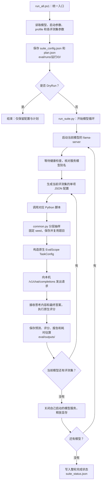

# EvalScope 分层抽样评测

统一入口 `run_all.ps1` 集中配置各评测集参数和两个 profile，自动依次启动、评测、关闭三个 GGUF 模型。每个数据集保留独立 Python 脚本，读取最终配置构造 `TaskConfig`。复用项目 EvalScope 1.12.0 和本地离线数据，不升级依赖。

## 公开仓库范围与独立使用

本仓库只包含原项目的 `eval/` 源码和文档，仓库根目录即原来的 eval 目录。模型、llama.cpp、Python 环境、完整评测数据及运行生成的样本、日志、成绩不随源码上传；`.gitignore` 排除 runs、outputs、samples 和缓存。

独立克隆后，在 `run_all.ps1` 顶部填写实际路径：

```powershell
$PythonExe = "D:/fab_insight/.venv/Scripts/python.exe"
$LlamaServerExe = "D:/fab_insight/runtimes/llama.cpp/llama-server.exe"
$ModelRoot = "D:/fab_insight/models"
$DataRoot = "D:/fab_insight/datasets/evalscope_full"
```

Python 环境需要项目使用的 EvalScope 1.12.0 及对应评测依赖；离线机器应沿用已准备的环境或离线依赖包。完整数据格式见下文“独立 Python 脚本与本地数据”。

从此仓库根目录检查或启动：

```powershell
& ./run_all.ps1 -Profile official -DryRun
& ./run_all.ps1 -Profile official -Datasets math_500 -Samples 5 -CheckData
& ./run_all.ps1 -Profile official -Hours 24
```

下文保留的 `./eval/...` 命令以原 deployment 项目根目录为工作目录；独立克隆时将该前缀改为 `./`。原项目的 `laptop_lab/env-eval.ps1` 不在本仓库内，独立使用时直接配置或激活自己的评测环境。

## 已确认的硬件、模型与两轮评测

目标机器为 **Windows + NVIDIA A10 24GB 单卡**。候选模型固定为：

| 模型 | GGUF 规格 | 建议模型别名 |
| --- | --- | --- |
| Qwen3-14B | Q5_K_M | qwen3_14b_q5_k_m |
| Qwen3.8-27B | Q4_K_M | qwen38_27b_q4_k_m |
| Qwen3.8-27B-Ridge | 3.7bpw | qwen38_27b_ridge_37bpw |

显卡一次只加载一个候选模型。首轮采用各基础模型的官方推荐生成参数；后续单独建立面向 FAB Agent 的部署参数轮。两轮的运行配置、样本和成绩应分别记录。

### 第一轮：official，按模型官方建议采样

下表区分 Thinking 与非 Thinking。两个 Qwen3.8-27B 量化版本使用同一套基础模型参数；Qwen3-14B 使用自己的官方参数，不强行将三个模型温度统一。

| 模型 / 模式 | temperature | top_p | top_k | min_p | presence_penalty |
| --- | ---: | ---: | ---: | ---: | ---: |
| Qwen3-14B / Thinking on | 0.6 | 0.95 | 20 | 0.0 | 0.0（本项目基线） |
| Qwen3-14B / Thinking off | 0.7 | 0.80 | 20 | 0.0 | 0.0（本项目基线） |
| Qwen3.8-27B Q4 / Thinking on | 1.0 | 0.95 | 20 | 0.0 | 0.0 |
| Qwen3.8-27B Ridge / Thinking on | 1.0 | 0.95 | 20 | 0.0 | 0.0 |
| Qwen3.8-27B Q4 / Thinking off | 0.7 | 0.80 | 20 | 0.0 | 1.5 |
| Qwen3.8-27B Ridge / Thinking off | 0.7 | 0.80 | 20 | 0.0 | 1.5 |

依据：[Qwen3-14B 官方模型卡](https://huggingface.co/Qwen/Qwen3-14B)、[Qwen3.8-27B 官方模型卡](https://huggingface.co/Qwen/Qwen3.8-27B)。Qwen3-14B 模型卡明确推荐温度、top_p、top_k 和 min_p；表中的 presence_penalty=0 是项目显式基线，不另称为该模型官方建议。Qwen3.8 官方还推荐 repetition_penalty=1.0，并默认使用 reasoning_effort=xhigh；该设置只应用于支持它的 Qwen3.8 模板，不将其视为 Qwen3-14B 的同等能力开关。

每题生成一次，n=1，固定 seed=42。官方采样参数用于本地量化模型的首轮比较，并不等同于复现官方榜单：量化、抽样、提示和输出预算均需随成绩记录。

各评测集的首轮模式与输出预算采用下面的本地起点；输出预算是 A10 / 24h 约束下的项目设置，不是官方模型能力上限：

| 评测集 | Thinking | max_tokens | few-shot |
| --- | --- | ---: | ---: |
| MATH-500 | on | 8192 | 0 |
| MMLU-Pro | on | 4096 | 5 |
| IFEval | off | 2048 | 0 |
| CMMLU | off | 2048 | 0 |
| C-Eval | off | 2048 | 0 |

同一数据集的三个模型保持相同模式、题目、输出预算、few-shot 与评分方式；温度等参数按上述官方模型配置选择。IFEval 评分只使用最终答案内容。思考 token 计入输出预算；达到长度上限的响应须在结果中记录，试跑后再决定是否增加预算。Context 同时容纳输入和输出，16K context 不能保证还有 16K 输出空间。

### 第二轮：fab_agent，面向部署行为进行比较

本轮用于观察候选模型在 FAB Agent 部署参数下的表现。下面列出当前 `run_all.ps1` 中 `$Profiles.fab_agent` 和 `$EvalTasks` 的实际默认值；这些是项目候选起点，需结合真实任务验证。修改 `generation`、`profile_overrides` 或 `dataset_overrides` 后，以最终 `plan.json` 和 TaskConfig 为准。

**按模型和 Thinking 模式设置的生成参数：**

| 模型 / 模式 | temperature | top_p | top_k | min_p | presence_penalty | reasoning_effort |
| --- | ---: | ---: | ---: | ---: | ---: | --- |
| Qwen3-14B Q5_K_M / Thinking on | 0.6 | 0.95 | 20 | 0.0 | 0.0 | 不传 |
| Qwen3-14B Q5_K_M / Thinking off | 0.1 | 0.95 | 20 | 0.0 | 0.0 | 不传 |
| Qwen3.8-27B Q4_K_M / Thinking on | 0.6 | 0.95 | 20 | 0.0 | 0.0 | medium |
| Qwen3.8-27B Q4_K_M / Thinking off | 0.1 | 0.95 | 20 | 0.0 | 0.0 | 不传 |
| Qwen3.8-27B Ridge-3.7bpw / Thinking on | 0.6 | 0.95 | 20 | 0.0 | 0.0 | medium |
| Qwen3.8-27B Ridge-3.7bpw / Thinking off | 0.1 | 0.95 | 20 | 0.0 | 0.0 | 不传 |

`reasoning_effort=medium` 仅对两个 Qwen3.8 模型的 Thinking 请求发送，须确认实际 GGUF 模板和 llama.cpp 版本支持。Qwen3-14B 不发送该字段，不将它视为三个模型间等价的推理强度开关。

**各评测集的第二轮默认设置：**

| 评测集 | Thinking | temperature | top_p | max_tokens | few-shot | 请求并发 |
| --- | --- | ---: | ---: | ---: | ---: | ---: |
| MATH-500 | on | 0.6 | 0.95 | 8192 | 0 | 1 |
| MMLU-Pro | on | 0.6 | 0.95 | 4096 | 5 | 1 |
| IFEval | off | 0.1 | 0.95 | 2048 | 0 | 1 |
| CMMLU | off | 0.1 | 0.95 | 2048 | 0 | 1 |
| C-Eval | off | 0.1 | 0.95 | 2048 | 0 | 1 |

这张表对三个模型都适用；两个 Qwen3.8 模型在前两项另带 `reasoning_effort=medium`。默认延用同一批固定抽样题；题数由整轮预算和本轮耗时估算计算，或在入口手动设置。

**第二轮的公共请求设置：**

| 参数 | 默认值 | 作用 |
| --- | --- | --- |
| repetition_penalty | 1.0 | 保持不额外惩罚重复 token 的基线 |
| n | 1 | 每题生成一个回答 |
| seed | 42 | 抽样与生成使用固定种子 |
| stream | true | 流式接收响应 |
| timeout | 1800 秒 | 单次 API 请求超时 |
| retries | 0 | EvalScope 请求重试次数 |
| SDK max_retries | 0 | OpenAI 兼容客户端重试次数 |
| 输出预算 | 按评测集设置 | Thinking token 和最终答案共同占用 |

简单的工具选择、参数填写和严格格式输出采用 Thinking off、temperature=0.1；根因分析、任务规划和多步推理使用 Thinking on、temperature=0.6，按任务调整输出预算。公开数据集的这套配置是部署参数比较，面向 FAB Agent 的最终结论还需工具调用和实际 FAB 工作流验证。

分别记录 official 与 fab_agent 的分数、延迟和截断情况，避免把两轮配置混成一个排名。低温度不保证答案正确，也需关注重复与推理质量变化。

## 统一入口：集中配置与自动切换已实现

正式入口是 `eval/run_all.ps1`，默认 `-Profile official -Hours 24`，自动依次启动三个模型、运行五个评测集，再关闭自己启动的服务。修改参数集中在这个文件顶部：

| 配置变量 | 修改内容 |
| --- | --- |
| `$PythonExe / $LlamaServerExe / $ModelRoot / $DataRoot` | 实际 Windows 环境、模型与数据路径 |
| `$ServerArgs` | Context、GPU 层、batch、ubatch、KV、parallel 等 llama.cpp 参数 |
| `$Models` | 三个 GGUF 文件、别名、模型所属 family、启动或请求特殊覆盖 |
| `$EvalTasks` | 各项目的题数、Thinking、max_tokens、few-shot、请求并发、耗时估算及 generation 覆盖 |
| `$Profiles` | official / fab_agent 的公共参数和各模型族的模式参数 |

例如给 MATH-500 自行指定总共 50 题，并修改该项目的 top_k，在 `$EvalTasks` 对应项设置：

```powershell
samples = 50
max_tokens = 8192
thinking = $true
few_shot_num = 0
batch_size = 1
generation = @{ top_k = 30 }
```

需要只在 FAB Agent 轮改变该项目，则在对应任务中设置：

```powershell
profile_overrides = @{
    fab_agent = @{
        max_tokens = 4096
        generation = @{ temperature = 0.4 }
    }
}
```

通常保持两个 27B 版本一致；确需模型专属配置时，在 `$Models` 的 `server_args` 或 `dataset_overrides` 中设置。参数顺序为：公共 profile → 模型族的 Thinking/非 Thinking 参数 → 模型全局 generation → 数据集 generation。数据集的 profile_overrides 和模型的 dataset_overrides 先合入任务，后者优先。同一 generation 中的嵌套 extra_body 也会合并。

`run_suite.py` 把最终配置写成逐项 JSON，通过 `--job-config` 传给各 Python 脚本。各脚本直接将完整 generation_config 用于 TaskConfig；服务器启动默认值不会取代明确的请求值。MMLU-Pro 的 validation 示例，以及启用 few-shot 的 C-Eval/CMMLU dev 示例，随抽样数据保留。

实际服务器参数、最终单项配置和日志保存在 `eval/runs/<运行ID>/`，`plan.json` 可检查所有组合，`suite_status.json` 记录退出码和整体完成情况。默认一次只加载一个模型；等待健康检查及别名匹配后开始评测，再终止自己创建的进程并切换下一个。评测失败会保存日志、继续其余项目，并让整轮返回非零。使用已有服务时只允许选择一个模型，结束后保留该服务。

## A10 / Windows 的 llama.cpp 启动建议

首轮三个模型统一从以下起点测试，具体开关以冻结版本的 llama-server --help 为准：

| 参数 | 建议起点 |
| --- | --- |
| GPU layers | all，全模型放 GPU |
| Context | 16384，单 slot |
| batch / ubatch | 1024 / 256 |
| parallel | 1；EvalScope 请求并发同样为 1 |
| KV cache | K、V 均 q8_0，GPU offload |
| Flash Attention | on |
| Jinja | on，使用各 GGUF 自己的原生模板 |
| reasoning / reasoning-format | auto / deepseek，按请求切换 Thinking |
| 自动 fit | 正式比较时 off，保持显式配置 |
| MTP / speculative | 首轮关闭 |

batch/ubatch 主要影响 Prompt 处理，parallel 是并发 slot 数。保留各模型原生模板，统一评测问题和输出要求；不将 Qwen3 与 Qwen3.8 强行套用同一个底层聊天模板。

Windows PowerShell 启动示例（路径按实际填写）：

```powershell
$LlamaServer = "D:/fab_insight/runtimes/llama.cpp/llama-server.exe"
$ModelFile = "D:/fab_insight/models/qwen3_14b_q5_k_m/model.gguf"
$ModelAlias = "qwen3_14b_q5_k_m"

& $LlamaServer -m $ModelFile --alias $ModelAlias `
    --host 127.0.0.1 --port 8080 `
    --gpu-layers all --ctx-size 16384 `
    --batch-size 1024 --ubatch-size 256 --parallel 1 `
    --cache-type-k q8_0 --cache-type-v q8_0 --flash-attn on `
    --jinja --reasoning auto --reasoning-format deepseek `
    --fit off --no-context-shift --metrics
```

其余两个模型替换 GGUF 路径和别名；一次只运行一个服务。请求采样参数由 official / fab_agent 和评测集配置决定，不依赖启动默认值。没有传入 mmproj，不启用 MTP。Q4_K_M 的文件体积约 19GB，Ridge 约 11.73GiB，文件大小不等于完整运行显存；先核对 Q4 的实际峰值和余量，再考虑三模型共同升到 32K。需要超过初始窗口的长上下文测试时，单独设置其启动 profile 并重新分配总耗时。

依据：[llama.cpp server 官方说明](https://github.com/ggml-org/llama.cpp/tree/master/tools/server)、[Q4_K_M 发布页](https://huggingface.co/ggml-org/Qwen3.8-27B-GGUF)、[Ridge 发布页](https://huggingface.co/empero-ai/Qwen3.8-27B-Ridge-GGUF)。以上是起始实验参数，尚无本机 A10 实測，不宣称已证明三个文件在此配置下稳定运行。

## 运行全链路

下图展示默认正式评测的完整执行路径。此处只是说明；阅读 README 不会执行命令，也不会启动模型。



默认顺序为：

```text
Qwen3-14B-Q5_K_M
  MATH-500 → MMLU-Pro → IFEval → CMMLU → C-Eval
  关闭服务
      ↓
Qwen3.8-27B-Q4_K_M
  同样的五个评测集、同一批抽样题
  关闭服务
      ↓
Qwen3.8-27B-Ridge-3.7bpw
  同样的五个评测集、同一批抽样题
  关闭服务
      ↓
汇总整轮状态
```

以 **official / Qwen3-14B / MATH-500** 为例，参数沿以下路径传递：

```text
run_all.ps1
  ├─ official + qwen3 + Thinking on
  │    temperature=0.6、top_p=0.95、top_k=20
  └─ MATH-500 配置
       输出上限8192、0-shot、并发1、固定抽样题数
            ↓
run_suite.py 合成配置，保存 math_500.json
            ↓
eval_math500.py --job-config <单项配置路径>
            ↓
common.arguments() 读取配置，prepare_sample() 准备固定题目
            ↓
TaskConfig.generation_config
            ↓
llama-server /v1/chat/completions
            ↓
模型响应 → 数学答案抽取与评分 → 原生 JSON/HTML 报告
```

`--reasoning-format deepseek` 用于将思考内容放入响应的 reasoning_content、最终答案放入 content；是否 Thinking 由请求配置控制，格式名称不改变所加载的 Qwen 模型。

**文件保存位置示意：** 下面的运行 ID、模型与样本路径是结构示例，不是一次新运行的产物。

```text
eval/
├─ samples/                         固定抽样题目，供三个模型复用
│  └─ math_500/n25_seed42/
│     ├─ README.md                  本地数据加载配置
│     ├─ default/test.jsonl
│     └─ selection.json
│
├─ runs/<运行ID>/                   整轮配置、日志和执行状态
│  ├─ suite_config.json             PowerShell 入口的完整配置
│  ├─ plan.json                     合成后的服务器命令与全部单项参数
│  ├─ suite_status.json             各项退出码与整轮是否通过
│  └─ qwen3_14b_q5_k_m/
│     ├─ server.log                 服务 stdout / stderr
│     ├─ math_500.json               传给 Python 的单项配置
│     └─ math_500.log                此项评测 stdout / stderr
│
└─ outputs/<profile>/<模型>/<评测集>/<运行ID>/
   ├─ configs/                      实际 TaskConfig
   ├─ predictions/                  模型回答
   ├─ reviews/                      逐题评分
   ├─ reports/                      汇总分数、HTML 报告
   ├─ selection.json                本次题目清单
   └─ budget_estimate.json           实测耗时与题数建议
```

三种检查/运行方式的区别：

| 方式 | 配置与计划 | 抽样、原生数据加载 | 启动服务、请求模型 | 原生评分报告 |
| --- | --- | --- | --- | --- |
| -DryRun | 保存 | 不执行 | 不执行 | 不生成 |
| -CheckData | 保存 | 执行 | 不执行 | 不生成 |
| 正式运行 | 保存 | 执行 | 执行 | 成功完成评分后生成 |

`-ExistingServer` 是单模型例外：连接并核对已有服务，不启动或关闭它。某个评测集子进程失败时，入口保存错误日志、继续其余项目，并在 suite_status.json 中记录失败；模型启动失败时记录该模型错误并处理下一个模型。失败任务可能只留下部分原生结果，整轮不会报告通过。

## 从统一入口开始

先在 `run_all.ps1` 填写实际路径。默认模型目录为 `D:/fab_insight/models`，默认文件名使用各发布的 GGUF 名称；如果本地已改名为 model.gguf，请同步修改 `$Models`。

从项目根目录执行：

```powershell
. ./laptop_lab/env-eval.ps1

# 查看三个模型 × 五个项目的实际参数，不启动服务、不请求模型、不读取数据。
# 会保存 suite_config.json 和 plan.json，便于先核对配置。
& ./eval/run_all.ps1 -Profile official -DryRun

# 从 MATH-500 的五题开始；仍使用官方参数和正式 Thinking 模式。
& ./eval/run_all.ps1 -Profile official -Datasets math_500 -Samples 5 -CheckData
& ./eval/run_all.ps1 -Profile official -Datasets math_500 -Samples 5

# 三个模型，全部项目，按当前耗时估算规划一轮 24h。
& ./eval/run_all.ps1 -Profile official -Hours 24

# 后续 FAB Agent 配置轮，结果与 official 分开。
& ./eval/run_all.ps1 -Profile fab_agent -Hours 24

# 仅选一个候选模型；整轮预算分母仍保留三个模型、五个项目。
& ./eval/run_all.ps1 -Profile official -Model qwen3_14b_q5_k_m -Datasets math_500

# 已手动启动某个候选模型时；不会启动或停止该服务。
& ./eval/run_all.ps1 -Profile official -Model qwen3_14b_q5_k_m -ExistingServer

# 快速协议检查：各项五题、Thinking off、输出 2048，不能当正式 official 成绩。
& ./eval/run_all.ps1 -Profile official -Datasets math_500 -Smoke
```

`-Samples N` 为本次所选项目统一指定总题数；长期按项目分别设置题数时，修改各任务的 `samples`。选择部分模型或项目不会把全部时间重新分给它们，保证单独补跑与整轮运行的默认题数一致。`-Smoke` 会覆盖题数、Thinking 和基础输出预算，只用于快速流程检查；`-Samples 5` 则保留正式模式，更适合估算首轮模型耗时。

模型已由统一入口管理，正式运行无需另开终端手动启动。启动端口和健康检查等待时间在入口顶部配置。Windows 子进程按参数列表执行，支持含空格的文件路径。

## 6、12、24 小时的抽取方案

**默认总预算 24 小时，包含当前所选一轮的三个模型、全部五个项目。** official 与 fab_agent 分别测量耗时、分别规划；如果要求两套 profile 也共同在一个 24h 内完成，预算还须除以 profile 数，不能给每套另分配完整的 24h。 预留 20% 给模型加载、评分及波动，其余时间按模型和项目均分。下面的秒/题是现有脚本的初始规划假设，尚未针对 official / fab_agent 分别测量，不是当前硬件实测；正式执行前必须用三个模型中最慢的实测值替换。各项目耗时不同，不能把 MATH-500 的速度用于全部项目。

| 项目 | 规划假设：秒/题 | 6h：每模型题数 | 12h：每模型题数 | 24h：每模型题数 |
| --- | ---: | ---: | ---: | ---: |
| MATH-500 | 180 | 6 | 12 | 25 |
| MMLU-Pro | 90 | 12 | 25 | 51 |
| IFEval | 15 | 76 | 153 | 307 |
| CMMLU | 45 | 25 | 51 | 102 |
| C-Eval | 45 | 25 | 51 | 102 |

公式：`题数 = floor(总小时 × 3600 × 0.8 ÷ 模型数 ÷ 项目数 ÷ 本项目秒/题)`。默认配置均为串行请求。使用入口的 `-Samples N` 或每个任务的 `samples` 可覆盖预算分配，N 是总题数；更改任务的 `batch_size` 后应重新测量吞吐。

单个项目结束后生成 `budget_estimate.json`，记录实测总耗时、加 25% 余量后的秒/题及建议题数。先分别做少量试跑，再取各项目三个模型中最慢的秒/题修改统一入口 `$EvalTasks` 对应项的 `seconds_per_sample`。例如 24h 下，本项实测 300 秒/题，则只分配 15 题。

这是耗时规划，不是硬性停止计时器；当前尚无三个候选模型的真实耗时，因此不能保证默认题数实际在 24h 内完成。增加 BFCL、RULER 等项目时，要配套添加对应脚本并纳入 `$EvalTasks`，入口据完整任务表计算项目数，不能给每项另分配 24 小时。

## 分层抽样与可比性

- MATH-500：按五个难度。
- MMLU-Pro、CMMLU：按学科。
- C-Eval：按学科目录，使用有答案的 val。
- IFEval：按第一条指令的类型，不复制含多条指令的题目。

题数足够时每层至少一题，剩余按各层容量比例分配，最大余数法保证总数精确；题数不足时仅覆盖部分层。层内实际调用 EvalScope 的 `StratifiedSampler` 随机抽样、不放回。额外分配配额是为了避免原生多层取整后题数不足，不是简单取每层前 N 题。

样本保存在 `eval/samples/<项目>/n<题数>_seed<种子>/`，`selection.json` 记录分层配额和源文件行号。不同模型使用相同数据、题数、`--seed`，复用相同题目；不要分别根据各模型速度改变题数。原生 `limit=None`，因为已经先抽好了精确总题数。

保持原始数据字段、原生提示模板和评分器。MATH-500 是 0-shot；MMLU-Pro 是 5-shot，保留 validation 示例；CMMLU、C-Eval 首版使用 0-shot。IFEval 保留四项规则指标。抽样分数不能称为全量成绩；题数少于学科数时，报告也不代表所有学科。

## 独立 Python 脚本与本地数据

仍保留各数据集的独立脚本，便于检查数据。独立使用 `--model` 属于 manual 参数轮，不会自动根据别名选择官方参数；正式两轮请优先使用统一入口。

```powershell
python ./eval/eval_math500.py --model laptop_qwen35_08b_q4 --samples 5 --check-data

# 当前笔记本上已启动的 0.8B 服务，五题检查；不用于 A10 三候选模型正式比较。
python ./eval/eval_math500.py --model laptop_qwen35_08b_q4 --samples 5 --max-tokens 2048 --thinking off
```

默认数据为 `laptop_lab/datasets/evalscope_full/<项目>/<subset>/<split>.jsonl`：math_500、mmlu_pro、cmmlu 用 test；ifeval 用 train；ceval 用 val。须为对应原生适配器的记录格式；five-shot 需要 validation 或 dev 示例。单个项目可在任务中用 `data_dir` 指定不同目录。`--job-config` 接收整项配置并优先于独立命令行参数。

**当前项目尚未准备真实 CMMLU 数据，也没有这三个候选模型的 GGUF 文件。** 在 A10 机器填写实际文件路径并补齐数据后才能正式运行；当前机器的计划检查不需要这些文件。可先用 `-Datasets math_500,mmlu_pro,ifeval,ceval -CheckData` 检查已有四套数据。CMMLU 缺失时会留下错误日志，整轮不会报告通过。

## 查看结果与验证范围

正式原生结果保存在 `eval/outputs/<profile>/<模型>/<项目>/<运行ID>/`，包括预测、逐题评分、实际 TaskConfig、JSON/HTML 报告、抽样清单和预算估算。独立 Python 使用 manual 目录。直接打开 `reports/report.html`，或启动可视化服务：

```powershell
evalscope service --host 127.0.0.1 --port 9000 --outputs ./eval/outputs
```

在浏览器打开 `http://127.0.0.1:9000`。评分和可视化使用原生结果格式。

本地已核对两套 profile 共 30 项参数进入各自 TaskConfig，以及四套真实数据的原生加载；CMMLU 仅用合成数据检查接口。用模拟服务验证三模型的顺序启动/关闭、失败清理和含空格路径，并通过真实 EvalScope 流式评分验证 official 参数转发、五条预测/评分和 HTML。模拟数据用于验证脚本，不是候选模型的能力成绩；尚未在 A10 上测量三个 GGUF 的性能。

原生采样器参考：[EvalScope Sampling Your Index Data](https://evalscope.readthedocs.io/en/v1.8.1/advanced_guides/collection/sample.html)。
